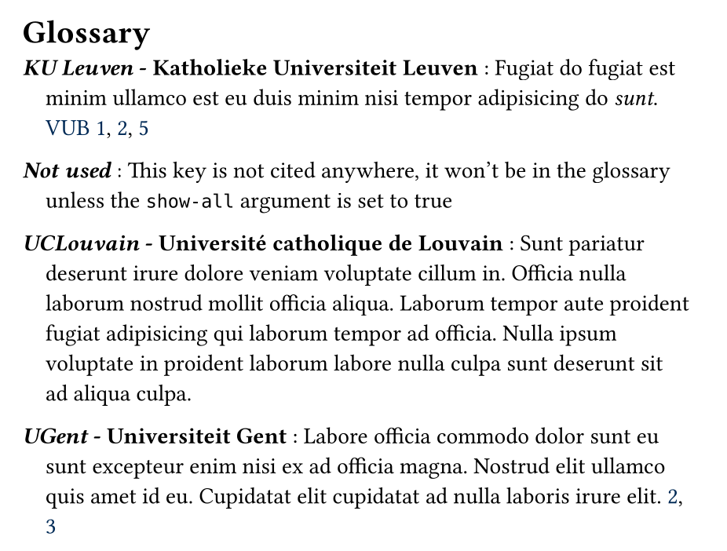

# Typst glossary

> Glossarium is based in great part of the work of [Sébastien d'Herbais de Thun](https://github.com/Dherse) from his master thesis available at: <https://github.com/Dherse/masterproef>. His glossary is available under the MIT license [here](https://github.com/Dherse/masterproef/blob/main/elems/acronyms.typ).

Glossarium is a simple, easily customizable typst glossary inspired by [LaTeX glossaries package](https://www.ctan.org/pkg/glossaries) . You can see an example showing the different features in [`example.typ`](example/example.typ).



## Manual 

### Import and setup

This manual assume you have a good enough understanding of typst markup and scripting. 

For Typst 0.6.0 or later import the package from the typst preview repository:

```ts
#import "@preview/glossarium:0.2.5": make-glossary, print-glossary, gls, glspl 
```

For Typst before 0.6.0 or to use **glossarium** as a local module, download the package files into your project folder and import `glossarium.typ`:

```js
#import "glossarium.typ": make-glossary, print-glossary, gls, glspl 
```

After importing the package and before making any calls to `gls`,` print-glossary` or `glspl`, please ***MAKE SURE*** you add this line
```js
#show: make-glossary
```

> *WHY DO WE NEED THAT ?* : In order to be able to create references to the terms in your glossary using typst ref syntax `@key` glossarium needs to setup some [show rules](https://typst.app/docs/tutorial/advanced-styling/) before any references exist. This is due to the way typst works, there is no workaround.
>
>Therefore I recommend that you always put the `#show: ...` statement on the line just below the `#import` statement.


### Printing the glossary

First we have to define the terms. 
A term is a [dictionary](https://typst.app/docs/reference/types/dictionary/) composed of 2 required and 2 optional elements: 

- `key` (string) *required*: used to make reference to the term.
- `short` (string) *required*: the short form of the term replacing the term citation. 
- `long` (string or content) *optional*: The long form of the term, displayed in the glossary and on the first citation of the term. 
- `desc` (string or content) *optional*: The description of the term.

Then the terms are passed as a list to `print-glossary`

```ts
#print-glossary((
  // minimal term
  (key: "kuleuven", short: "KU Leuven"),
  // a term with a long form
  (key: "unamur", short: "UNamur", long: "Université de Namur"),
  // no long form here
  (key: "kdecom", short: "KDE Community", desc:"An international team developing and distributing Open Source software."),
  // a full term with description containing markup
  (
    key: "oidc", 
    short: "OIDC", 
    long: "OpenID Connect", 
    desc: [OpenID is an open standard and decentralized authentication protocol promoted by the non-profit
     #link("https://en.wikipedia.org/wiki/OpenID#OpenID_Foundation")[OpenID Foundation].]),
))
```

By default, the terms that are not referenced in the document are not shown in the glossary, you can force their appearance by setting the `show-all` argument to true

You can call this function from anywhere.

### Referencing terms.

Referencing terms is done using the key of the terms using the `gls` function or the reference syntax.

```ts
// referencing the OIDC term using gls
#gls("oidc")
// displaying the long form forcibly
#gls("oidc", long: true)

// referencing the OIDC term using the reference syntax
@oidc
```

#### Handling plurals

You can use the `glspl` function and the references supplements to pluralize terms:

```ts
#glspl("oidc") // equivalent of `#gls("oidc", suffix: "s")`
// or
@oidc[s]
```

#### Overriding the text shown

You can also override the text displayed by setting the `display` argument.

```ts
#gls("oidc", display: "whatever you want") 
```

## Final tips

I recommend setting a show rule for the links to that your reader understand that they can click on the references to go to the term in the glossary.

```ts
#show link: set text(fill: blue.darken(60%))
// links are now blue ! 
```

## Changelog

### 0.2.4

### Fixed

- Fixed a bug where the reference would a long ref even when "long" was set to false (e4644f4) by [@dscso](https://github.com/dscso)

### Changed

- The glossary appearance have been improved slightly (a1ee80e) by [@JuliDi](https://github.com/JuliDi)

### Previous versions did not have a changelog entry